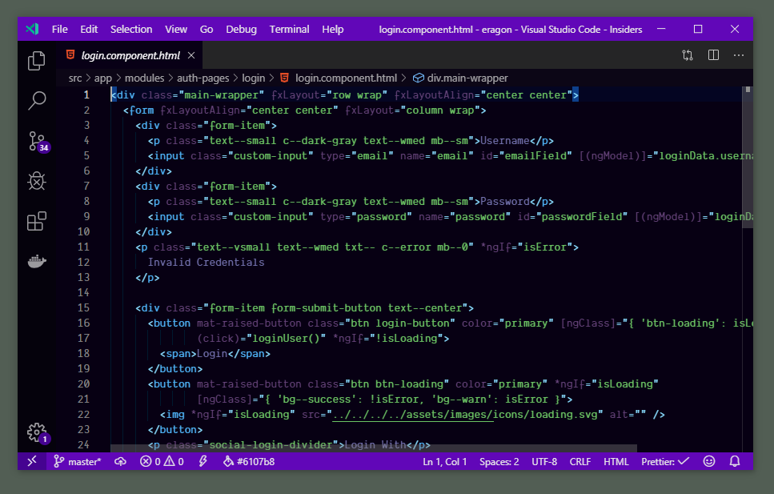
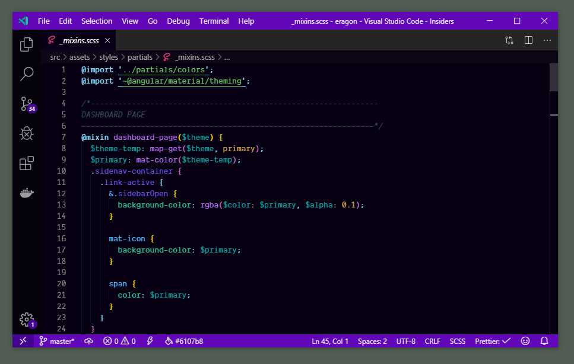

# Dark The Shit Out


Your new theme for night time coding. A theme made expecially for all those who love dark theme everywhere.

Dark The Shit Out - Dark Theme for VSCode. I am a fan of Dark Themes and i use it everywhere, on my phone, laptop, my IDE etc.

I made this theme to get a balance between color and the dark vibe. I like blue and it shades so i opted for blue.







## How to Install

1. Open **Extensions** sidebar panel in Visual Studio Code. `View → Extensions`
1. Search for `Dark The Shit Out`
1. Click **Install**
1. Click **Set Color Theme**
1. Optional: Use the recommended settings below for best experience

## Recommended Settings

```json
{
  "editor.fontFamily": "Fira Code",
  "editor.fontLigatures": true,
  "editor.formatOnPaste": true,
  "editor.formatOnType": false,
  "editor.formatOnSave": true,
  "editor.letterSpacing": 0.5,
  "editor.lineHeight": 25,
  "zenMode.centerLayout": false
}
```

## Feedback

If you have suggestions, please [open an issue](https://github.com/adisreyaj/vscode-dark-the-shit-out/issues) or better yet, a [pull request](https://github.com/adisreyaj/vscode-dark-the-shit-out/pulls).

## Special Thanks

John Papa - You are just great!

**Enjoy!**
